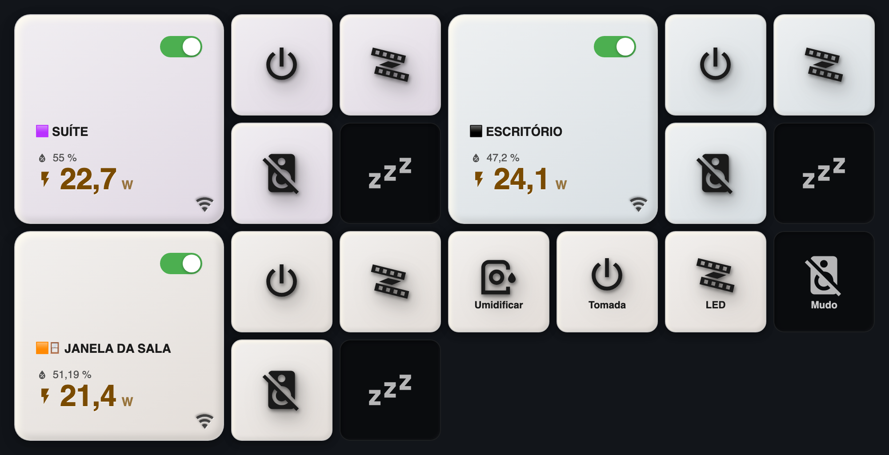
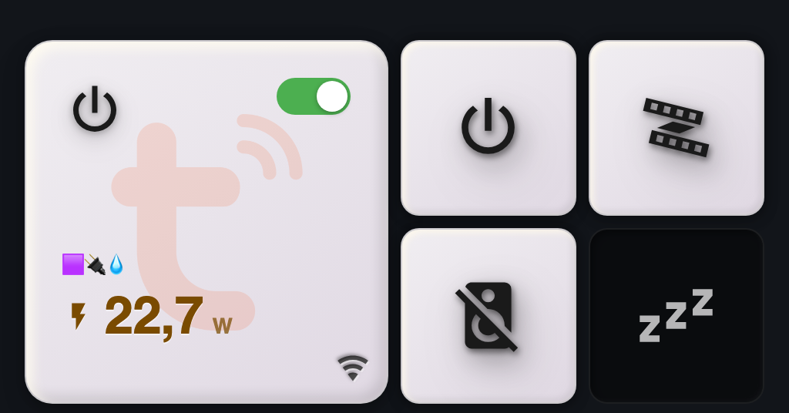
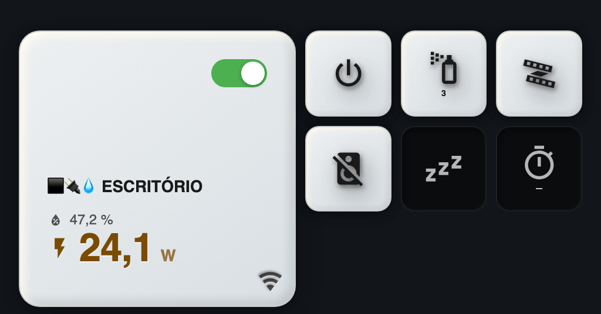
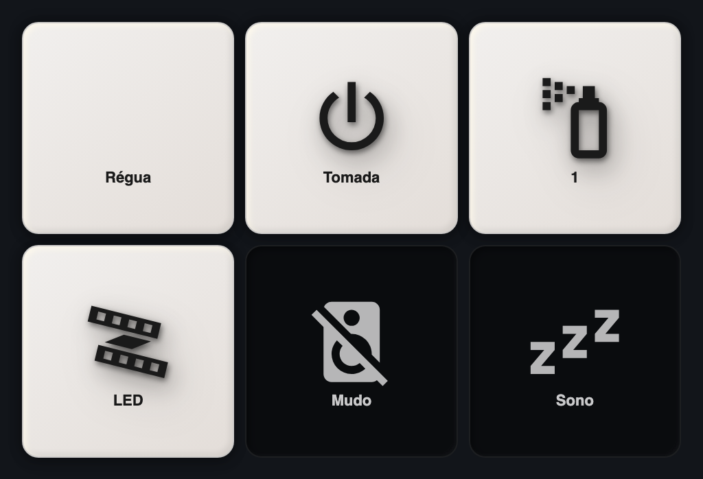
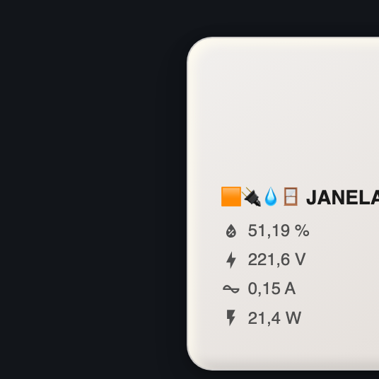
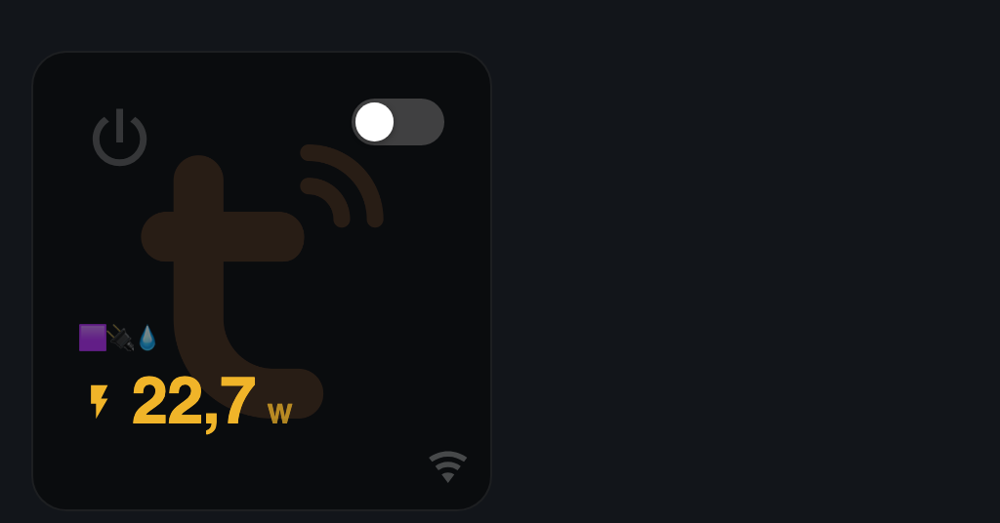
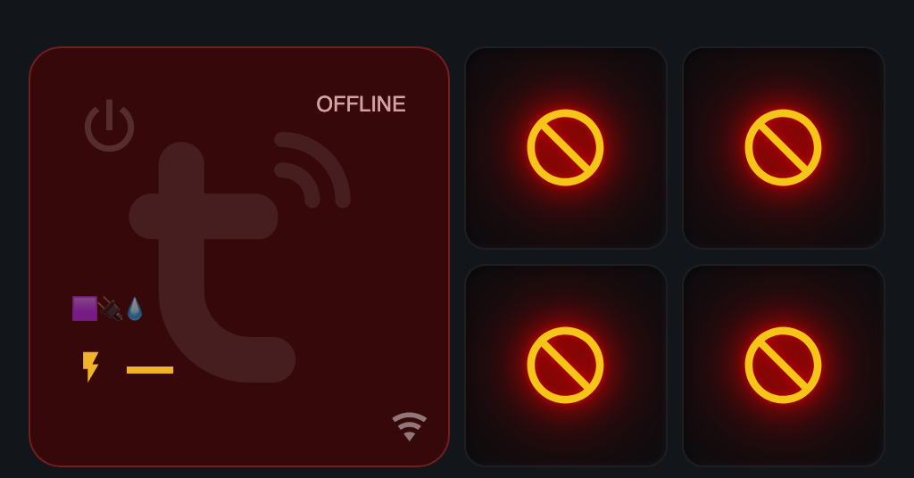

<!-- MW-BRAND:BEGIN — gerado por IA/tools/mw-brand.sh · não editar à mão -->
<p align="center">
  <a href="https://github.com/visaodeempresa">
    
  </a>
  <br>
  <sub><b>Visão de Empresa</b> · componente de Home Assistant por MAYCON WILLIAN OLIVEIRA</sub>
</p>
<!-- MW-BRAND:END -->

# MW Humidifier Card

[](https://hacs.xyz)

Card do Lovelace para **umidificador inteligente ligado numa tomada
inteligente** — o par que quase sempre anda junto, num objeto só.

```
┌─────────────────────┬──────────┬──────────┐
│ ⏻            ●━━━   │    ⏻     │   ▨▨▨    │
│ 🟪🔌💧 TOMADA       │          │          │
│ UMIDIFICADOR SUÍTE  ├──────────┼──────────┤
│ ⚡ 22,7 w       ᯤ   │    🔇    │   z zᶻ   │
└─────────────────────┴──────────┴──────────┘
   a tomada, com V/A/W      os botões do aparelho
```

À esquerda a tomada em papel/neumórfico com a potência em destaque; à direita
os botões quadrados do aparelho (tomada, LED, mudo, sono, nível de névoa,
timer). **Com a tomada desligada os botões somem** — aparelho sem energia só
sabe dizer `unavailable`, e uma fileira de 🚫 não informa nada que o selo
`OFFLINE` já não tenha contado.

Arquivo único, sem build: `dist/mw-humidifier-card.js` é fonte e artefato. JS
puro + `<ha-form>`, sem dependências.



*Os quatro umidificadores da casa — suíte, escritório, janela da sala e sala de
yoga (esta em `only_humidifier`, porque a régua não mede consumo por saída).*

## Os três modos

| `mode` | O que desenha | Quando usar |
|---|---|---|
| `with_power` *(padrão)* | Tomada **+** botões do aparelho | O caso normal: umidificador numa tomada que mede consumo. |
| `only_humidifier` | Só os botões | A tomada não mede nada (régua de 4 saídas), ou o consumo já está em outro card. |
| `only_power` | Só a tomada | O aparelho não expõe controles ao HA, ou você só quer a energia. |

## Parentesco (e independência)

Mesma família do
[power-button](https://github.com/visaodeempresa/mw-ha-power-button-card),
[simple-button](https://github.com/visaodeempresa/mw-ha-simple-button-card),
[door-window](https://github.com/visaodeempresa/mw-ha-door-window-card),
[occupancy-motion](https://github.com/visaodeempresa/mw-ha-occupancy-motion-card)
e [temp-humidity](https://github.com/visaodeempresa/mw-ha-temp-humidity-card):
**código próprio, nada compartilhado** (ADR 0002). O bloco da tomada é um port
do `power-button-card` e os botões são um port do `custom:button-card`
quadrado — copiados de propósito, para que os três possam divergir sem que um
quebre o outro. A única exceção é a **paleta de papel**, que é dado e não
comportamento, e vive em `IA/lib/paper-palette/`.

Duas coisas já divergiram do original, de propósito:

- **A unidade sai da entidade, não do código.** O `power-button-card` escreve
  `V` e `A` fixos; os umidificadores Tuya locais reportam corrente em **mA**, e
  `153,0 A` seria mentira de três ordens de grandeza.
- **O `uppercase` não vale para as leituras.** Herdado do template original,
  ele transformava `153 mA` em `153 MA` — miliampère virava megaampère.

## Instalação

### HACS

1. HACS → **⋮** → **Repositórios personalizados**
2. URL: `https://github.com/visaodeempresa/mw-ha-humidifier-card` ·
   Categoria: **Dashboard**
3. Instalar **MW Humidifier Card** e recarregar a página (⌘⇧R).

### Manual

`dist/mw-humidifier-card.js` em `/config/www/` e o recurso
`/local/mw-humidifier-card.js` (Módulo JavaScript) em
**Configurações → Painéis → ⋮ → Recursos**.

## Uso mínimo

```yaml
type: custom:mw-humidifier-card
entity: switch.tomada_umidificador_suite_local_tomada
sensor_potencia: sensor.tomada_umidificador_suite_local_potencia
buttons:
  - switch.suite_umidificador_da_suite_local_tomada
  - switch.suite_umidificador_da_suite_local_led
  - switch.suite_umidificador_da_suite_local_mute
  - switch.suite_umidificador_da_suite_local_sleep
```

Os ícones **não precisam ser informados**: o card lê o fim do `entity_id` e
reconhece o papel do botão — `_tomada` → ⏻, `_led` → fita de LED, `_mute` → 🔇,
`_sleep` → 💤, `_spraying_level` → borrifador, `_countdown` → cronômetro,
`_trava_para_criancas` → cadeado.

---

## Exemplos

### 1 · Suíte — o card da foto (`with_power`)



Substitui a grade de `power-button-card` + quatro `custom:button-card` inteira,
inclusive a `visibility:` que escondia os botões.

```yaml
type: custom:mw-humidifier-card
mode: with_power
name: 🟪🔌💧
entity: switch.tomada_umidificador_suite_local_tomada
sensor_potencia: sensor.tomada_umidificador_suite_local_potencia
device_icon: mdi:power
background_image_url: >-
  https://raw.githubusercontent.com/mayconsoftware/mayconsoftware.github.io/refs/heads/main/assets/devices/ha-integration/ha-integration-tuya.png
protocol_icon: mdi:wifi
protocol_offset_x: 11
protocol_offset_y: 11
power_lift: 12
paper_color: violet-3
confirm: true
buttons:
  - switch.suite_umidificador_da_suite_local_tomada
  - switch.suite_umidificador_da_suite_local_led
  - switch.suite_umidificador_da_suite_local_mute
  - switch.suite_umidificador_da_suite_local_sleep
```

### 2 · Escritório — com nível de névoa, timer e a umidade do ambiente



Seis botões em três colunas. O `select` do nível de névoa vira um botão que
**gira** a cada toque (`LEVEL 1` → `2` → `3` → `1`) e mostra o número dentro
do quadrado; o `countdown` em `cancel` conta como desligado.

```yaml
type: custom:mw-humidifier-card
name: ⬛️🔌💧 ESCRITÓRIO
entity: switch.tomada_umidificador_escritorio_socket_1
sensor_potencia: sensor.tomada_umidificador_escritorio_potencia
humidity_entity: sensor.umidade_da_mesa_do_escritorio
protocol_icon: mdi:wifi
button_columns: 3
buttons:
  - switch.escritorio_umidificador_escritorio_local_tomada
  - select.escritorio_umidificador_escritorio_local_spraying_level
  - switch.escritorio_umidificador_escritorio_local_led
  - switch.escritorio_umidificador_escritorio_local_mute
  - switch.escritorio_umidificador_escritorio_local_sleep
  - select.escritorio_umidificador_escritorio_local_countdown
```

### 3 · Sala de yoga — `only_humidifier`



A saída fica numa régua de quatro tomadas, que não mede consumo por saída.
Sem número para mostrar, o bloco de energia não tem por que existir — mas a
saída da régua entra como **mais um botão**, e o aparelho continua inteiro.

```yaml
type: custom:mw-humidifier-card
mode: only_humidifier
button_columns: 3
show_button_names: true
buttons:
  - entity: switch.tomadas_da_sala_de_yoga_umidificador
    icon: mdi:power-plug
    name: Régua
  - switch.umidificador_da_sala_local_tomada
  - select.umidificador_da_sala_spraying_level
  - switch.umidificador_da_sala_local_led
  - switch.umidificador_da_sala_local_mute
  - switch.umidificador_da_sala_sleep
```

### 4 · Janela da sala — `only_power` com V, A e W em linha



Quando o que interessa é a energia: `power_big: false` traz de volta as três
linhas do template original, cada uma com a **unidade da própria entidade**.

```yaml
type: custom:mw-humidifier-card
mode: only_power
name: 🟧🔌💧🪟 JANELA DA SALA
entity: switch.tomada_do_umidificador_da_janela_da_sala
sensor_voltagem: sensor.tomada_do_umidificador_da_janela_da_sala_voltagem
sensor_corrente: sensor.tomada_do_umidificador_da_janela_da_sala_corrente
sensor_potencia: sensor.tomada_do_umidificador_da_janela_da_sala_potencia
power_big: false
humidity_entity: sensor.umidade_da_janela_da_sala
protocol_icon: mdi:wifi
paper_color: orange-3
```

### 5 · Parede de umidificadores

Os quatro da casa lado a lado, cada um no papel do seu cômodo.

```yaml
type: grid
columns: 2
square: false
cards:
  - type: custom:mw-humidifier-card
    name: 🟪 SUÍTE
    paper_color: violet-3
    entity: switch.tomada_umidificador_suite_local_tomada
    sensor_potencia: sensor.tomada_umidificador_suite_local_potencia
    humidity_entity: sensor.umidade_media_da_area_da_suite
    buttons:
      - switch.suite_umidificador_da_suite_local_tomada
      - switch.suite_umidificador_da_suite_local_led
      - switch.suite_umidificador_da_suite_local_mute
      - switch.suite_umidificador_da_suite_local_sleep
  - type: custom:mw-humidifier-card
    name: ⬛️ ESCRITÓRIO
    paper_color: blue-3
    entity: switch.tomada_umidificador_escritorio_socket_1
    sensor_potencia: sensor.tomada_umidificador_escritorio_potencia
    humidity_entity: sensor.umidade_da_mesa_do_escritorio
    buttons:
      - switch.escritorio_umidificador_escritorio_local_tomada
      - switch.escritorio_umidificador_escritorio_local_led
      - switch.escritorio_umidificador_escritorio_local_mute
      - switch.escritorio_umidificador_escritorio_local_sleep
  - type: custom:mw-humidifier-card
    name: 🟧🪟 JANELA DA SALA
    paper_color: orange-3
    entity: switch.tomada_do_umidificador_da_janela_da_sala
    sensor_potencia: sensor.tomada_do_umidificador_da_janela_da_sala_potencia
    humidity_entity: sensor.umidade_da_janela_da_sala
    buttons:
      - switch.umidificador_da_janela_da_sala_local_tomada
      - switch.umidificador_da_janela_da_sala_local_led
      - switch.umidificador_da_janela_da_sala_local_mute
      - switch.umidificador_da_janela_da_sala_sleep
  - type: custom:mw-humidifier-card
    mode: only_humidifier
    paper_color: orange-3
    button_columns: 4
    buttons:
      - switch.tomadas_da_sala_de_yoga_umidificador
      - switch.umidificador_da_sala_local_tomada
      - switch.umidificador_da_sala_local_led
      - switch.umidificador_da_sala_local_mute
```

### 6 · Ícone e nome à mão

A lista aceita `entity_id` solto (forma curta, a que o editor grava) **ou** o
objeto completo. Misturar as duas na mesma lista é permitido.

```yaml
buttons:
  - switch.suite_umidificador_da_suite_local_tomada        # ícone automático
  - entity: switch.suite_umidificador_da_suite_local_led
    icon: mdi:lamp
    name: Luzinha
```

O editor visual **preserva** o que você escreveu à mão: ele grava a lista curta,
mas reencontra pelo `entity_id` o que tinha ícone ou nome próprio.

---

## Estados

Os quatro estados que o YAML escrito à mão costuma esquecer, cada um com o seu
desenho — e nenhum deles escreve `unavailable` na tela:

| | |
|---|---|
|  | **Tomada desligada.** Os botões somem (`hide_controls_when_off`) e as duas colunas continuam lá: **a altura do card não muda**. |
|  | **Sem resposta.** Fundo vinho, selo `OFFLINE`, potência em travessão. A marca d'água ganha `brightness(1.8)` para não sumir no vinho, e cada botão vira 🚫 âmbar com halo vermelho. *(aqui com `hide_controls_when_off: false`, para mostrar os botões)* |

## Editor visual

| Campo | O que faz |
|---|---|
| **Modo do card** | Os três modos. Trocar o modo esconde o que não se aplica — `only_power` não pede botões, `only_humidifier` não pede tomada. |
| **Tomada inteligente** | Qualquer `switch`. Os sensores de V/A/W abaixo passam a listar só os **do mesmo dispositivo** da tomada. |
| **Sensor de Potência** | Filtrado por `device_class` dentro do dispositivo, com queda em cascata: dispositivo → nome parecido → todos os sensores. |
| **Potência em destaque** | Ligado (padrão): número grande, sem V e A. Desligado: revela os dois selects de tensão e corrente. |
| **Dispositivo do umidificador** | Lista os dispositivos que casam com «umidific/humidif/vaporiz/difusor» e, se não houver nenhum, todo dispositivo com dois ou mais switches. **— todos os dispositivos —** tira o filtro. |
| **Botões do aparelho** | Seletor múltiplo, filtrado pelo dispositivo. A ordem de escolha é a ordem na tela. Trocar de dispositivo já traz os switches do novo, na ordem canônica. |

O editor **não grava defaults no YAML** e nunca perde uma chave que o esquema
tenha escondido.

## Propriedades

### Modo e blocos

| Propriedade | Tipo | Padrão | Descrição |
|---|---|---|---|
| `mode` | `with_power` \| `only_humidifier` \| `only_power` | `with_power` | Que blocos desenhar. |
| `entity` | string | — | Tomada (`switch`). Obrigatória fora do `only_humidifier`. |
| `buttons` | lista | `[]` | Botões do aparelho. Obrigatória fora do `only_power`. |
| `hide_controls_when_off` | bool | `true` | Esconde os botões enquanto a tomada não estiver ligada. |

### Bloco da tomada

| Propriedade | Tipo | Padrão | Descrição |
|---|---|---|---|
| `name` | string | `""` | Vazio = `friendly_name` da tomada. |
| `sensor_potencia` / `sensor_voltagem` / `sensor_corrente` | string | `""` | Leituras. A **unidade vem da entidade**. |
| `humidity_entity` | string | `""` | Umidade do ambiente, numa linha própria. |
| `power_big` | bool | `true` | Potência em número grande; `false` traz V e A de volta. |
| `power_font_size` | número | `34` | Tamanho da potência em destaque (px). |
| `power_lift` | número | `6` | Sobe nome e potência (px) — sem V/A o bloco fica baixo demais. |
| `device_icon` / `image_url` | ícone / URL | `""` | Aparelho no canto superior esquerdo. |
| `background_image_url` | URL | `""` | Marca d'água. O editor traz Tuya e Tapo prontas. |
| `background_transparent` | 0..1 | `0.12` | Opacidade da marca d'água. |
| `protocol_icon` | ícone | `""` | Selinho de protocolo no canto inferior direito. |
| `protocol_offset_x` / `protocol_offset_y` | número | `10` | Distância do selinho até a borda (px). |
| `animate` | bool | `false` | Gira o ícone do aparelho enquanto ligado. |
| `control` | bool | `true` | `false` trava o interruptor (geladeira, roteador…). |

### Bloco dos botões

| Propriedade | Tipo | Padrão | Descrição |
|---|---|---|---|
| `device` | string | `""` | ID do dispositivo; só o editor usa, para filtrar. |
| `button_columns` | número | `2` | Colunas da grade de botões. |
| `button_icon_size` | número | `46` | Tamanho do ícone dentro do botão (% do quadrado). |
| `button_radius` | número | `12` | Arredondamento do botão (px). |
| `show_button_names` | bool | `false` | Escreve o papel do botão embaixo do ícone. |
| `show_select_value` | bool | `true` | Mostra o valor das listas (`LEVEL 3` → `3`). |
| `confirm_buttons` | bool | `false` | Pergunta antes de acionar cada botão. |

### Comuns

| Propriedade | Tipo | Padrão | Descrição |
|---|---|---|---|
| `paper_color` | `paper` \| `<matiz>-<1..7>` | `paper` | Papel do card ligado. 7 matizes × 7 tons. |
| `gap` | número | `8` | Espaço entre os blocos e entre os botões (px). |
| `height` | string | `""` | Altura do card em CSS. Vazio = automática. |
| `haptic` | bool | `true` | Vibração ao tocar (companion app / Chrome Android). |
| `confirm` | bool | `false` | Pergunta antes de ligar/desligar a tomada. |
| `confirm_text` | string | *(ver abaixo)* | `{nome}` e `{acao}` são substituídos. |

Padrão do texto: `Tem certeza que quer {acao} {nome}?`

### Cores

Ajustáveis no editor, com cor **e** transparência: `color_power_on/off`,
`color_on_border`, `color_on_name`, `color_on_subtext`, `color_off_*`,
`color_unavail_*`, `color_unknown_*`, `protocol_color_on/off` e, só dos botões,
`color_btn_icon_off`, `color_btn_name_off` e `color_btn_dead`.

## O que cada toque faz

| Onde | Toque curto | Toque longo |
|---|---|---|
| Interruptor da tomada | Liga/desliga (com confirmação, se ligada) | — |
| Linha de sensor | Abre os detalhes do sensor | — |
| Resto da tomada | — | Detalhes da tomada |
| Botão `switch`/`light`/`fan`/`humidifier` | `homeassistant.toggle` | Detalhes |
| Botão `select` | Gira para a próxima opção | Detalhes |
| Botão `button`/`scene`/`script` | Aciona | Detalhes |

## Geometria

No `with_power` as duas colunas são iguais (`1fr 1fr`) e o bloco da tomada é
**quadrado** — por isso quatro botões em duas colunas fecham exatamente a mesma
altura. Com a tomada desligada os botões somem e as duas colunas continuam lá:
**a altura do card não muda**, e a parede de umidificadores não dança.

O quadrado é garantido por `container-type: size`: com contenção de tamanho o
conteúdo **não pode** empurrar a altura do tile. E para que ele não vaze em vez
de esticar, toda a tipografia de dentro é proporcional ao lado do quadrado
(`cqw`), tomando 236 px como referência — inclusive o `line-height`, que é
declarado **sem unidade** para não herdar o valor absoluto que o frontend do HA
define no `body` (esse, por ser fixo, não encolheria junto). Na prática: o card
tem a mesma cara em 480 px e em 120 px de largura, a tomada é quadrada em
qualquer uma, e o conteúdo ocupa sempre a mesma fração dela.

Nos modos de bloco único o card preenche o espaço que receber — use
`square: true` na grade do Lovelace, ou a propriedade `height`.

## Desenvolvimento

```bash
node --check dist/mw-humidifier-card.js
node tools/probe.js                 # 79 verificações, sem navegador
```

O probe instancia card e editor fora do browser com as entidades **reais** da
casa: pega grade quebrada, campo sumido do editor e default vazando para o YAML
sem depender do HA.

## Licença

MIT © MAYCON WILLIAN OLIVEIRA
